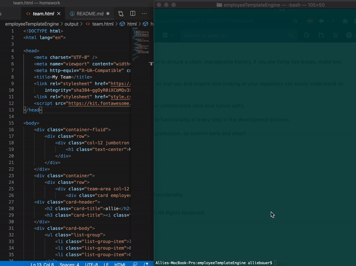

# Employee Template Generator

## Description

This node cli app leverages inquirer to ask the user a series of questions about their employees. From the answers employees are created via constructor classes and their properties are rendered into a generated HTML document.

## Usage 

Run the following command to start the app, then follow the prompts:

~~~
node app.js
~~~

Please see the below gif for a demonstration of app functionality:

